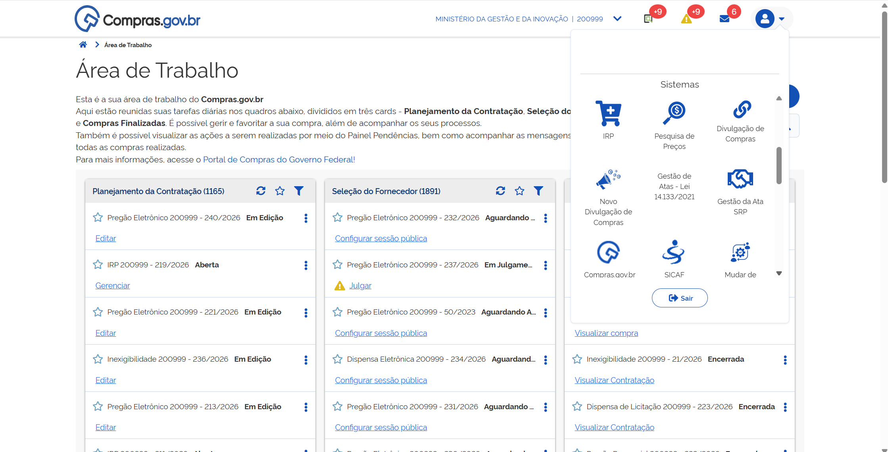

 
<button onclick="window.print()" style="background-color: #0056b3; color: white; padding: 10px 20px; border: none; border-radius: 5px; font-size: 16px; cursor: pointer; box-shadow: 0 2px 4px rgba(0,0,0,0.2);">
  🖨️ Imprimir esta página
</button>

**Passo 1:** Acesse o Portal de Compras do Governo Federal e clique em “Acesso ao Sistema”.

---

**Passo 2:** Escolha o perfil Governo e clique em “Entrar com Gov.br”.

---

**Passo 3:** Na área de trabalho do usuário Governo, clique em “Novo Divulgação de Compras”.

---

**Passo 4:** E em seguida clique em “+Criar”.

---

**Passo 5:** Preencha todas as informações relacionadas ao processo e clique em “Concluir”.

# Segunda Etapa: Divulgar a Contratação

Nesta etapa, preencheremos os dados básicos, o fundamento legal e as informações essenciais para a publicação do certame.

---

### Preenchimento de dados da contratação

**Passo 6:** Encontre a contratação desejada na aba **Contratações Minhas Uasg** e clique em “Editar”.

> **OBS.:** O número de controle interno da UASG tem por objetivo permitir que cada órgão tenha seu controle de processos registrado no sistema para melhor rastreabilidade. O preenchimento desse número é facultativo.
>
> **Atenção!** Neste manual, faremos o passo a passo de uma concorrência, mas as demais modalidades seguem os mesmos passos.

---

**Passo 7:** Na aba **Dados Básicos da Contratação**, preencha o número do processo, o número de controle interno da UASG e, no **Tipo de contratação**, escolha a modalidade de licitação.

---

**Passo 8:** Para definir o **Fundamento legal** da contratação, clique no ícone de lápis.

Navegue pela lista de fundamentos legais disponíveis no sistema.

Detalhe os fundamentos legais disponíveis e, quando localizar a opção adequada, clique sobre o texto e depois em “Salvar”.

---

**Passo 9:** Em **Modo de disputa**, selecione a opção de acordo com a definição do edital – *aberto, fechado, aberto/fechado ou fechado/aberto*.

---

**Passo 10:** Em **Critério de julgamento**, o sistema trará a opção padrão (*default*) “Menor preço/maior desconto” por se tratar de pregão.

---

**Passo 11:** Em **Forma de realização**, selecione entre “eletrônico” e “presencial”.

> **Observação:**
> * A opção **Eletrônico** encaminhará seu processo para a sala de disputa virtual.
> * A opção **Presencial** resultará na realização de sessão pública presencial.

---

**Passo 12:** Selecione o **Tipo de objeto** a ser licitado na lista apresentada no sistema.

---

**Passo 13:** Para obras e serviços de engenharia, o sistema apresentará o campo para informar o **Regime de execução** do contrato.

---

**Passo 14:** Preencha os campos de **Categoria** e **Moeda da Compra**.

---

**Passos 15 e 16:** Na aba **Dados adicionais da contratação**, preencha os dados do empenho para a publicação no DOU, bem como as datas de início e fim de recebimento de propostas.

# Terceira Etapa: Inclusão e Configuração de Itens

Existem duas formas de incluir itens na sua contratação: diretamente pelo **Catálogo integrado** ou por meio do upload de uma **Planilha Eletrônica**.

---

## Opção A: Inclusão de Itens pelo Catálogo

**Passo 18:** Na aba **Itens/Grupos**, clique em “+Adicionar”.

---

**Passo 19:** Pesquise pelos termos desejados na barra de busca.

---

**Passo 20:** Escolha se é material ou serviço e procure pelo item desejado. Quando encontrado, clique em **Detalhar** e, em seguida, no ícone **"+"**.

---

**Passo 21:** Verifique a unidade de fornecimento, inclua o valor unitário e clique em **Salvar**. Repita os passos para todos os itens.

---

**Passos 22 e 23:** Após inserir os itens, clique no carrinho no canto superior direito e confirme a inclusão.

---

## Opção B: Inclusão de Itens por Planilha Eletrônica

**Passo 24:** Na aba **Itens/Grupos**, clique no ícone **Upload de itens**.

> **Atenção!** O sistema apresentará um link para download do modelo oficial de planilha. Esse modelo deve ser seguido rigorosamente para a correta importação.

---

**Passos 25 e 26:** Faça o download da planilha modelo, preencha-a, selecione o arquivo e clique em **Confirmar**.

---

## Configuração Detalhada dos Itens e Locais de Entrega

**Passos 28 a 31:** Clique em **Expandir** no item para definir o Critério de Julgamento, Variação de Lances e Intervalo Mínimo.

---

**Passos 32 a 36:** Em **Locais de Entrega**, adicione os endereços e as quantidades para cada local correspondente.

---

## Atribuição de Benefícios (ME/EPP, Margem de Preferência e Conteúdo Nacional)

**Passo 37:** Na aba **Benefícios**, configure se haverá benefício exclusivo, cota reservada ou subcontratação para ME/EPP.

> **Importante:** Caso não aplique benefícios para ME/EPP, selecione obrigatoriamente a justificativa correspondente no sistema.

 
